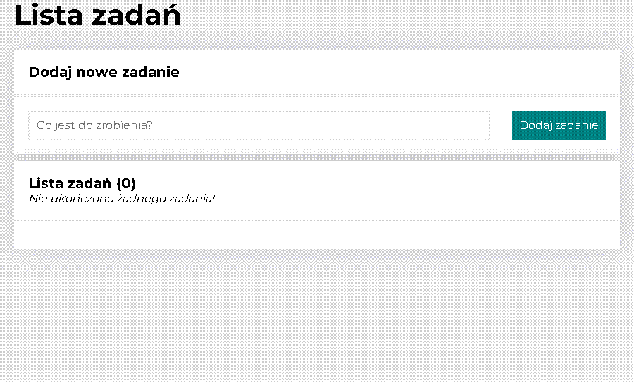

# Task List with Redux!

## 💪 To do list - how to use❔

This website has only one specific function, look:
👆 https://grzegorz-kolaty.github.io/to-do-list-react2/ 👆

## 🧑 Do not forget to see my homepage❕

My homepage 👆 https://grzegorz-kolaty.github.io/homepage/ 👆

Please do not forget to check my other projects on my homepage - trying to be best developer you can find here :)

## ⚒ My work

Currency converter 👆 https://grzegorz-kolaty.github.io/currency-converter-react/ 👆

## ⚙ Used technologies and languages

- HTML, CSS, BEM, Redux-Saga
- Local Storage imports, exports
- React Router - it's single page app!
- Flex, Grid, OpenGraph, Styled Components
- JavaScript, Custom React Hooks
- ES6+ features,
- projects are DesktopFirst (not MobileFirst) but completly adjusted for smartphones!

This project was bootstrapped with [Create React App](https://github.com/facebook/create-react-app).

## Available Scripts

In the project directory, you can run:

### `npm start`

Runs the app in the development mode.\
Open [http://localhost:3000](http://localhost:3000) to view it in your browser.

The page will reload when you make changes.\
You may also see any lint errors in the console.

### `npm run build`

Builds the app for production to the `build` folder.\
It correctly bundles React in production mode and optimizes the build for the best performance.

The build is minified and the filenames include the hashes.\
Your app is ready to be deployed!

See the section about [deployment](https://facebook.github.io/create-react-app/docs/deployment) for more information.
